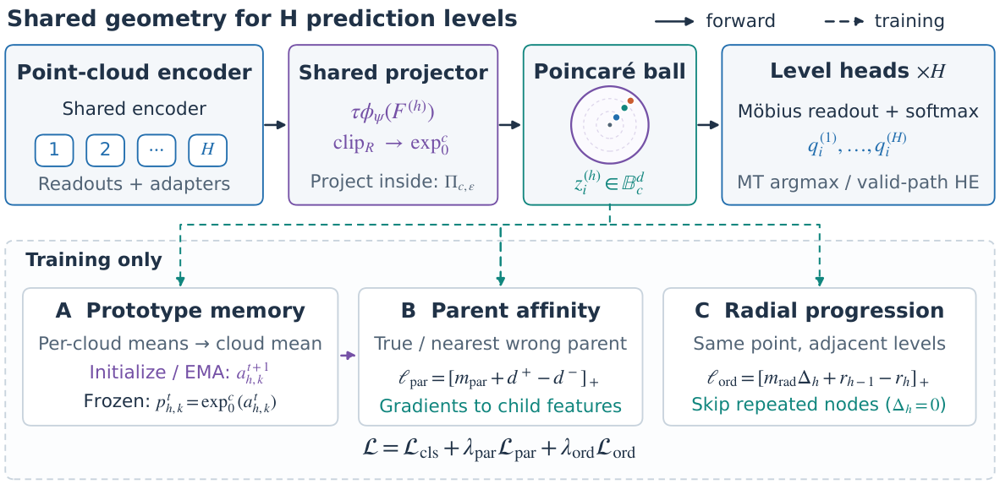

# HY3D: TAHL3DPC



统一的 PartNeXt / Campus3D 消融实验代码，通过 `--model` 和 `--dataset` 参数切换模型与数据集。

## 环境安装

```bash
conda create -n hy3d python=3.8
conda activate hy3d
pip install -r requirements.txt
```

## 快速开始

```bash
# 训练（默认数据集 partnext）
python -m Hy3D.run --model baseline   # PointNet++ Euclidean baseline
python -m Hy3D.run --model m0          # + 双曲投影 + Euclidean 分类头
python -m Hy3D.run --model m1          # + Mobius 分类头
python -m Hy3D.run --model m2          # m0 + PCT 损失
python -m Hy3D.run --model hy3d        # m1 + PCT 损失（完整模型）

# 切换到 Campus3D 数据集
python -m Hy3D.run --dataset campus3d --model hy3d

# 测试
python -m Hy3D.run --model hy3d --eval
python -m Hy3D.run --dataset campus3d --model m1 --eval

# 自定义实验名（不指定则使用默认值）
python -m Hy3D.run --model m0 --exp_name MY_M0_RUN
```

## 模型预设

| model    | SEG_HEAD_TYPE  | PCT_ENABLE | 说明                              |
|----------|----------------|------------|-----------------------------------|
| baseline | euclidean_raw  | False      | 纯 Euclidean PointNet++           |
| m0       | euclidean_hyp  | False      | + 双曲投影 + Conv 分类头          |
| m1       | mobius         | False      | + Mobius 分类头                   |
| m2       | euclidean_hyp  | True       | m0 + PCT 损失                     |
| hy3d     | mobius         | True       | m1 + PCT 损失（完整模型）         |

## 数据集

| dataset  | 说明                    | 配置目录                          |
|----------|-------------------------|-----------------------------------|
| partnext | PartNeXt 数据集（默认） | `Hy3D/configs/partnext/`          |
| campus3d | Campus3D 数据集         | `Hy3D/configs/campus3d/`          |

也可用 `--config_dir` 指定自定义配置目录。

- PartNeXt 下载：https://github.com/AuthorityWang/PartNeXt
- Campus3D 下载：https://github.com/shinke-li/Campus3D

## 冒烟测试

```bash
python -m Hy3D.smoke_test
```
